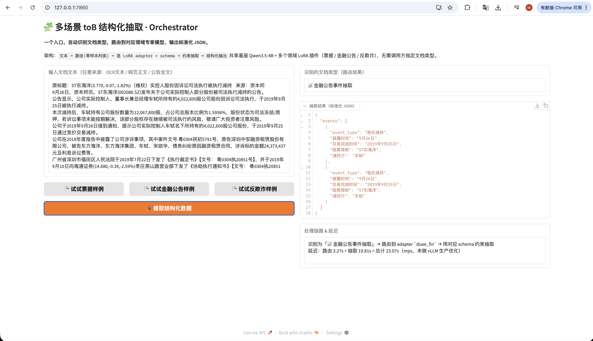

# Multi-Domain Structured Extraction Orchestrator

### Fine-tuned local model vs. frontier API — turning a procurement decision into a measurable experiment

[简体中文](README.md) · **English**

Any to-B document-extraction project hits the same fork early: the client's data can't leave
their network, so do you buy a frontier LLM API, or fine-tune a small model on-premise? That
call is usually made on gut feel. This project makes it measurable — three domains that differ
in language, document type *and* task structure; one shared 4B base model; one LoRA recipe;
one evaluator — run the full experiment matrix, then package the conclusion as an extraction
service that exposes a single entry point.

**Full experiment design, three-domain results and the selection conclusion**:
<https://mingwen.net/projects/extract-orchestrator.html>

> Every number, every measurement caveat and every methodological limitation lives on the
> detail page above — this README deliberately does not repeat them, **so the two can't drift
> apart**.

| Receipt → `cord` | Financial filing → `duee_fin` | Fraud case → `ccks_fraud` |
| --- | --- | --- |
|  |  |  |

One entry point, one 4B base model. The caller never has to say what kind of document this
is: the system classifies zero-shot, swaps to the matching adapter, extracts under that
domain's schema, and reports which path it took and how long each leg took. The ~20s latency
in these screenshots is an unoptimised local Mac dev setup — a vLLM deployment is expected to
be an order of magnitude faster.
>
> The rest of this repository's documentation is in Chinese.

## The conclusion, in one paragraph

Fine-tuning lifts all three domains by a consistent **+0.49–0.54 micro-F1** (0.409 / 0.322 /
0.223 → 0.945 / 0.861 / 0.714, schema validity to 100% across the board). But **the zero-shot
comparison was not a fair one**: the local model had seen 800 labelled examples and the APIs
had seen none. Re-running with in-context examples, the local 4B's lead over the best API
collapses from 8 points to 1.8 — and re-running the same API on the same items at
temperature 0 already swings ±1.4 points. So **accuracy is no longer a reason to pick either
side.** What's left is compliance (can the data leave the network at all), cost *shape*
(per-call forever vs. paid once up front) and output determinism. The full self-correction is
written up in §4.3 and §7.2 of the detail page.

## Current state

| Component | Status |
| --- | --- |
| Three-domain conversion + leakage audit | ✅ CORD / DuEE-fin / CCKS-fraud; `dedup_check.py` is mandatory before onboarding a domain |
| Experiment matrix E0–E4 | ✅ base free-form / base constrained / LoRA / LoRA constrained / six frontier and Chinese APIs |
| Few-shot gradient | ✅ 0/4/8/16/32/64 (Gemini and MiniMax run the full curve; the rest at 0 and 16) |
| Orchestrator | ✅ zero-shot routing + three-adapter hot swap, 98.9% routing accuracy across domains |
| Out-of-domain fallback | 🔶 behaviour and fill-rate thresholds measured; the fix itself is not implemented (detail page §7.1) |
| Production serving | ❌ local transformers + PEFT dev setup; vLLM multi-LoRA is design only |

## Design decisions worth noting

- **Routing has no trained classifier.** The base model classifies zero-shot, so adding a
  domain means adding a description to a registry — no retraining, no interface change.
- **Leakage checks are not a formality.** CORD's 100-item test set contained 8 items
  duplicated from the official train split (an upstream dataset issue). All reported figures
  use the de-duplicated 92-item subset.
- **The three domains fail differently and are fixed identically.** Base-model errors are type
  mismatch (CORD), semantic hallucination and dropped qualifiers (DuEE-fin), and pseudo-value
  filling (CCKS) — one recipe fixes all three, which is why fine-tuning here is solving
  *format and behaviour alignment*, not knowledge injection.

## Run it

```bash
uv sync                          # core: data + evaluation
uv run python -m tests.test_eval # offline self-check, no downloads needed

uv sync --extra infer            # transformers + peft + torch + outlines
uv sync --extra demo             # gradio
uv run python scripts/demo_app.py   # interactive multi-domain demo at 127.0.0.1:7860
```

Data conversion, training, per-experiment commands and the domain-extension procedure are
documented in the [Chinese README](README.md).

Datasets are public academic corpora (CORD / DuEE-fin / CCKS2021). No real customer
documents are included.

## Stack

Qwen3.5-4B base · HF PEFT / Unsloth (training) · transformers + PEFT (evaluation and serving) ·
Pydantic schemas · Outlines constrained decoding · Gradio · vLLM multi-LoRA (designed, not benchmarked)
