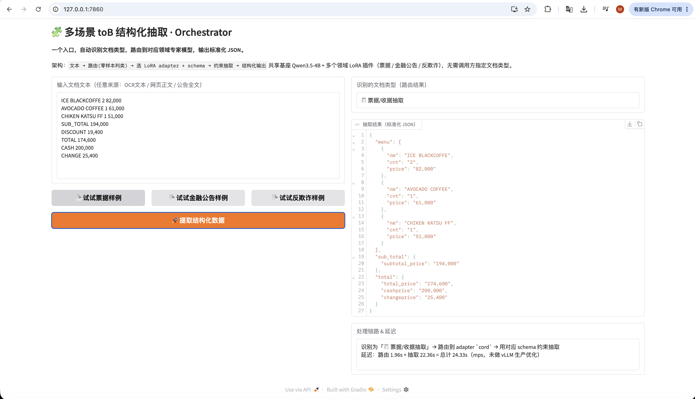
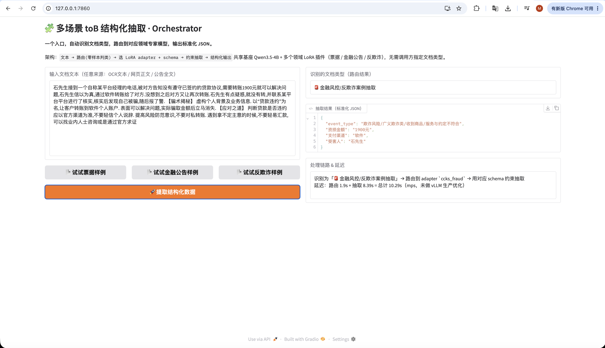

# 多场景结构化抽取 Orchestrator · 本地微调 vs 大模型 API 的选型实验

**简体中文** · [English](README.en.md)

做 to-B 文档抽取绕不开一个岔路口：客户数据不能出内网，那到底该买通用大模型 API，还是在本地微调一个小模型？这个问题通常靠拍脑袋，这个项目把它做成了可测的实验——三个语言、文档类型、任务结构都不同的域，同一个 4B 基座、同一套 LoRA 配方、同一把评测尺子，跑完整实验矩阵，再把结论包装成一个对外只有一个入口的抽取服务。

**完整实验设计、三域结果与选型结论**：<https://mingwen.net/projects/extract-orchestrator.html>

> 全部数字、口径与方法论局限都写在详情页，本 README 不重复——**避免两处数字打架**。这里只讲怎么跑起来、代码长什么样。

| 票据（路由至 `cord`） | 反欺诈（路由至 `ccks_fraud`） |
| --- | --- |
|  |  |

同一个入口、同一个 4B 基座，调用方不需要告诉系统这是什么类型的文档：系统零样本判类、切到对应 adapter、按该域 schema 约束抽取，并回报走了哪条链路与各段延迟。截图里的延迟（10~25 秒）是 Mac 本地未优化的开发环境数字，生产用 vLLM 部署预期快一个量级。

## 一句话结论

三域微调提升稳定在 **+0.49~0.54**（micro-F1 由 0.409 / 0.322 / 0.223 提升至 0.945 / 0.861 / 0.714，schema 合法率全部拉到 100%）。但**零示例对照并不公平**：补上 in-context 示例重测后，本地 4B 对最优 API 的领先从 8 个点收敛到 1.8 个点，而 API 自身重跑波动就有 ±1.4 个点——所以**精度不再是选型理由**，剩下的是合规、成本结构与输出确定性。这个自我修正的完整过程写在详情页 §4.3 与 §7.2。

## 当前状态

| 部分 | 状态 |
| --- | --- |
| 三域数据转换与泄漏核查 | ✅ CORD / DuEE-fin / CCKS-fraud，接入前必跑 `dedup_check.py` |
| 实验矩阵 E0–E4 | ✅ 基座自由 / 基座约束 / LoRA 自由 / LoRA 约束 / 六个前沿与国产 API 对照 |
| few-shot 梯度对照 | ✅ 0/4/8/16/32/64 六档（Gemini、MiniMax 跑满，其余 0 与 16 两档） |
| Orchestrator | ✅ 零样本路由 + 三 adapter 热切换，三域路由准确率 98.9% |
| 域外兜底 | 🔶 已实测域外行为与填充率阈值，方案未实现（详情页 §7.1） |
| 生产部署 | ❌ 本地 transformers+PEFT 开发配置；vLLM 多 LoRA 只做了架构设计 |

- 定位与方案：[`doc/plans/项目定位与方案.md`](doc/plans/项目定位与方案.md)（WHY）· 执行计划：[`doc/plans/PLAN.md`](doc/plans/PLAN.md)（WHAT/下一步）
- 原始结果：[`runs/`](runs/)（各域 `*_results.md`、`e4_fewshot_summary.md`、`ood_probe_summary.md`）
- 产品 Demo：`uv run python scripts/demo_app.py` 本地起一个可交互的多域抽取 Gradio 界面
- 基座锁定：**Qwen3.5-4B** · 训练：**HF PEFT / Unsloth** · 评测：**transformers + PEFT** · 服务：**PEFT 多 adapter（本地）/ vLLM 多 LoRA（生产设计）**
- 数据集为公开学术数据（CORD / DuEE-fin / CCKS2021），不含任何真实客户文档

## 目录结构

```
doc/
  plans/           # 方案与计划（定位 / PLAN / CORD 实验计划）
  site/            # HTML 展示站点（index 为入口，可互相跳转）
shared/
  schema.py        # Pydantic 领域 schema + system prompt（SCHEMA_REGISTRY 注册新域，当前3个）
  normalize.py     # 字段归一化（金额/日期/空白/全半角）
  json_utils.py    # 从模型输出中鲁棒提取 JSON（剥 ```json``` 包裹）
  eval.py          # 评测器：flatten → 多重集 → P/R/F1（micro/macro/per-field）+ JSON 合法率
  router.py        # 零样本路由 prompt 构建 + 输出解析（新增域自动纳入，无需重训分类器）
  convert_cord.py / convert_duee_fin.py / convert_ccks.py  # 各域 原始标注 → 训练/评测 jsonl
  dedup_check.py   # train/test 数据泄漏核查（新域接入前必跑）
scripts/
  run_inference.py     # E0-E3 本地推理（transformers+peft，可选 Outlines 约束）
  run_ollama.py        # Ollama 基线推理（Mac 本地）
  run_api.py            # 前沿/国产大模型 API 对照（E4）
  run_orchestrator.py   # 端到端 Orchestrator：路由（复用基座零样本，disable_adapter）+ 多adapter抽取
  demo_app.py            # Gradio 产品 demo（本地跑 -> http://127.0.0.1:7860）
  train_cord.py / cord_train_colab.ipynb  # Colab/Unsloth 训练（各域复用同一脚本，产出 HF adapter）
tests/test_eval.py     # 评测器离线单测（无需模型/下载）
adapters/{cord,duee_fin,ccks_fraud}/  # 训练好的 3 个 LoRA adapter（共享同一基座）
data/{cord,duee_fin_cn,ccks_fraud_cn}/  # 转换后的数据（各域 train/val/test split，已去重复核查）
runs/              # 推理输出 + 结果（各域 baseline/results.md）
legacy/            # 早期草稿方案（已归档，不再维护）
```

## 快速开始（用 uv 管理环境）

依赖分组：核心（数据+评测，默认装）/ `infer`（本地推理+约束解码）/ `baseline`（API 对照）/ `demo`（Gradio）。

```bash
# 安装核心依赖（建 .venv）
uv sync

# 1) 离线自测（验证评测器逻辑，无需下载）
uv run python -m tests.test_eval
uv run python -m shared.convert_cord --sample

# 2) 生成 CORD 数据（需联网下载 naver-clova-ix/cord-v2）
uv run python -m shared.convert_cord --out data/cord

# 3) 本地推理/评测需要重包，按需加装：
uv sync --extra infer        # transformers + peft + torch + outlines
uv sync --extra baseline     # API 对照 (E4)
uv sync --extra demo         # gradio

# 4) 基线 E0/E1（无需训练）
uv run python scripts/run_inference.py --base Qwen/Qwen3.5-4B \
    --eval-file data/cord/test.eval.jsonl --out runs/e0.jsonl
uv run python -m shared.eval --pred runs/e0.jsonl --gold data/cord/test.eval.jsonl --name "E0 基座·自由"

# 5) 训练（见 scripts/train_cord_colab.md，在 Colab 上）→ 下载到 adapters/cord/
# 6) E2/E3 评测（见 train_cord_colab.md 第 7 节）
```

## 实验矩阵

| 编号 | 配置 | 命令要点 |
|---|---|---|
| E0 | 基座·自由 | `--base` |
| E1 | 基座·约束 | `--base --constrained` |
| E2 | LoRA·自由 | `--base --adapter` |
| E3 | LoRA·约束 ⭐ | `--base --adapter --constrained` |
| E4 | 前沿 / 国产 API 对照 | `scripts/run_api.py`（已跑 Gemini / Qwen / Claude / DeepSeek / Kimi / GLM / MiniMax，含 few-shot 梯度） |

## 扩展到新领域（Phase 2）

1. 在 `shared/schema.py` 的 `SCHEMA_REGISTRY` 注册新域（pydantic 模型 + task 描述）
2. 写 `shared/convert_<域>.py`（标注 → `{system,user,gt}` / messages）
3. 复用 `run_inference.py` + `shared.eval`，训练同基座同 r=16 的新 adapter
4. Orchestrator 路由无需改动——新域在注册表里加一段描述即自动生效，不重训任何模型；生产侧的 vLLM 多 adapter 热插拔仍是设计，未实测
```
