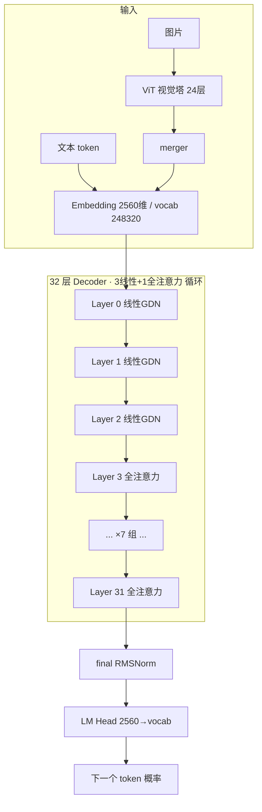

# Qwen3.5-4B 架构解析（含我们 LoRA 调的层）

> 面向本项目（CORD 结构化抽取）的架构笔记：每个部位是什么、为什么这么设计、我们在哪儿挂 LoRA。
> 配置来源：`Qwen/Qwen3.5-4B/config.json`。现成架构图见文末「参考」。

---

## 0. 关键配置（4B dense）

| 项 | 值 | 说明 |
|---|---|---|
| decoder 层数 | **32** | 主干 |
| hidden_size | **2560** | 残差流宽度 |
| 注意力头 | **16 Q / 4 KV** | GQA（KV 头更少，省显存） |
| head_dim | **256** | 每头维度（注意：16×256=4096 ≠ hidden，单独投影） |
| MLP intermediate | **9216** | SwiGLU 中间维 |
| 层类型 | **3×线性 + 1×全注意力 循环** | `full_attention_interval=4` |
| → 拆分 | **24 层 Gated DeltaNet + 8 层 full attention** | 全注意力在第 3,7,…,31 层 |
| vocab | **248320** | 超大词表（多语 + 多模态特殊 token） |
| 视觉塔 | **ViT 24 层 / hidden 1024 / patch 16** | 多模态，文本任务不用 |
| 许可证 | **Apache 2.0** | 可商用/可微调/可再分发 |

---

## 1. 整体架构



### 单层内部（两种层 + 共用 MLP）
```
线性层 ×24 (Gated DeltaNet)            全注意力层 ×8 (Self-Attention)
┌──────────────────────────┐          ┌──────────────────────────┐
│ x ─► RMSNorm              │          │ x ─► RMSNorm              │
│     ► GatedDeltaNet       │          │     ► GQA Attn + RoPE     │
│        (q/k/v + 门控/衰减) │          │        q_proj k_proj      │
│     ► + 残差              │          │        v_proj o_proj      │
│ ─► RMSNorm                │          │     ► + 残差              │
│     ► MLP(SwiGLU)         │          │ ─► RMSNorm                │
│        gate/up/down_proj  │          │     ► MLP(SwiGLU)         │
│     ► + 残差              │          │        gate/up/down_proj  │
└──────────────────────────┘          └──────────────────────────┘
```

---

## 2. 逐部位设计与逻辑

### 2.1 Tokenizer + Embedding（vocab 248320）
- **是什么**：把文本切成 token，查表成 2560 维向量；图片经视觉塔后也映射到同一空间，拼进序列。
- **为什么大词表**：要覆盖 **多语言（200+ 语言）+ 多模态特殊 token**（`<image>`、`<vision_start>` 等），所以词表比纯英文模型大很多。
- **对我们的影响**：CORD 是英文/数字小票，词表绰绰有余；Embedding 冻结。

### 2.2 视觉塔 ViT（24 层）+ merger
- **是什么**：标准 Vision Transformer，把图片切成 16×16 patch → 编码 → merger 把相邻 patch 合并降数量 → 投影成「视觉 token」喂进主干。
- **为什么有它**：Qwen3.5 原生多模态，图文走同一个 decoder。
- **对我们的影响**：Phase 1–4 只用文本，**视觉塔整块冻结、甚至不加载**；但 Phase 5 想做「图片→JSON」时，正是复用这块（这也是我们选 Qwen3.5 的原因）。

### 2.3 主干：混合注意力（核心设计）
32 层里 **3 层线性 + 1 层全注意力** 循环。这是整个架构最关键的取舍。

#### a) Gated DeltaNet 层（线性注意力，占 75%）
- **是什么**：一种**线性/循环式**注意力。不像标准注意力那样"每个 token 看全部历史"（O(n²)），而是维护一个**固定大小的状态矩阵**，逐 token 用「delta 规则」更新（写入新的键值关联），再加一个**门控（gate）**控制旧状态的衰减/遗忘。
- **逻辑**：
  - delta 规则 ≈ 在线学习一张"关联记忆表"，新信息覆盖/修正旧关联；
  - 门控 ≈ 决定记多久、忘多快（类似 LSTM 的遗忘门）。
- **为什么用它**：复杂度接近 **线性**，显存/计算不随序列长度二次爆炸 → 这就是 Qwen3.5 能上 **262K~1M 上下文**的根本原因。
- **代价**：固定状态容量有限，**对"精确回忆某个远处细节"较弱**（记忆会被压缩/遗忘）。

#### b) Full Attention 层（全注意力，占 25%）
- **是什么**：标准 softmax 自注意力 + **GQA**（16 Q 头共享 4 组 KV，省 KV cache）+ **RoPE**（旋转位置编码）。
- **为什么保留 1/4**：全注意力能**精确检索任意位置**的信息，补上线性层"记忆模糊"的短板。每 4 层插 1 层全注意力，等于**定期做一次全局精确对齐**。
- **设计哲学**：线性层负责"高效地带着压缩记忆往前走"，全注意力层负责"需要时精确回头查"——**省钱(线性) + 不丢精度(全注意力) 的折中**。

> 对我们抽取任务：小票/合同文本不长（百到千 token），长上下文优势用不太到；但**全注意力层对"从文本里精确定位某个字段值"很重要**，这正是抽取需要的能力。

### 2.4 MLP（SwiGLU：gate/up/down_proj）
- **是什么**：每层注意力之后的前馈网络。SwiGLU = `down( SiLU(gate(x)) * up(x) )`，两条上投影（gate 2560→9216、up 2560→9216）做门控相乘，再下投影（down 9216→2560）。
- **逻辑**：注意力负责"token 之间混信息"，MLP 负责"每个 token 内部做非线性变换/存知识"。
- **占参数大头**：9216 的中间维让 MLP 成为参数最多的部分 → **微调时调 MLP 收益高**。

### 2.5 RMSNorm + 残差
- **是什么**：每个子层前做 RMSNorm（比 LayerNorm 轻），输出加残差。
- **逻辑**：稳定训练、让梯度顺畅；**Pre-Norm** 结构。冻结不调。

### 2.6 Dense vs MoE
- **4B 是 dense**：每层 MLP 是单个 SwiGLU，所有参数都参与。
- **大模型（35B/122B/397B）是 MoE**：把 MLP 换成多专家 + 路由，每 token 只激活少数专家（省算力）。
- **对我们**：选 dense 4B → **没有路由/专家**，结构简单、微调和 vLLM 多 LoRA 都更省心（MoE 的 LoRA 才有 fused-expert 兼容坑）。

### 2.7 LM Head
- **是什么**：最后 RMSNorm → 线性层 2560→vocab，输出每个 token 的概率。
- 冻结不调。

---

## 3. 我们 LoRA 调哪几层

LoRA = 冻结基座，在选定的线性层旁挂一个低秩旁路（A·B，r=16）。按名字匹配。

| 部位 | 模块 | 在哪些层 | LoRA |
|---|---|---|---|
| 全注意力 | q_proj / k_proj / v_proj / o_proj | 8 个全注意力层 | ✅ |
| MLP | gate_proj / up_proj / down_proj | **全部 32 层** | ✅ |
| GDN 内部 q/k/v 投影 | （命名依实现而定） | 24 个线性层 | ⚠️ 命中则调 |
| GDN 门控/衰减/卷积 | b_proj/decay/conv 等 | 24 个线性层 | ❌ 冻结 |
| Embedding / LM Head / RMSNorm | — | 全局 | ❌ 冻结 |
| 视觉塔 ViT + merger | — | 视觉 | ❌ 冻结 |

**确定调到**：32 层全部 MLP + 8 个全注意力层的 Q/K/V/O。
**灰色地带**：24 个 GDN 层的内部投影，取决于命名是否匹配。

### 建议：混合架构上用 `all-linear` 保证覆盖
```python
target_modules = "all-linear"   # 命中所有 nn.Linear（含 GDN 投影），只排除 LM head
```
这样 24 个 GDN 层不会被漏掉。A100 显存吃得下。验证：
```python
print({n.split('.')[-1] for n,_ in model.named_modules() if 'proj' in n})  # 真实投影名
model.print_trainable_parameters()                                         # 可训练参数占比
```

---

## 4. 为什么这套架构适合（也限制）我们的任务

| 特性 | 对结构化抽取的意义 |
|---|---|
| 线性注意力(75%) → 长上下文 | 小票/合同不长，**优势用不太到**；但长合同（RealKIE）时有用 |
| 全注意力(25%) → 精确检索 | **关键**：抽取就是"从文本精确定位字段值"，靠这些层 |
| dense 4B | 结构简单，**LoRA + vLLM 多 LoRA 最省心** |
| 原生多模态 | **Phase 5 复用同基座做图片→JSON**，不换模型 |
| Apache 2.0 | 训出的 adapter/模型可放简历/产品，无 license 顾虑 |

---

## 5. 参考（含现成架构图）

- [Qwen3.5: Nobody Agrees on Attention Anymore — Maxime Labonne (HF Blog)](https://huggingface.co/blog/mlabonne/qwen35)
- [Gated DeltaNet 教程 — Sebastian Raschka (LLMs-from-scratch)](https://github.com/rasbt/LLMs-from-scratch/blob/main/ch04/08_deltanet/README.md)
- [Qwen3.5 Hybrid Attention (Gated DeltaNet + MoE) 部署解析](https://ai.tekin.cn/en/blog/qwen3-5-hybrid-attention-gated-deltanet-moe-deployment)
- [Why Did Qwen3.5 Choose Gated DeltaNet?](https://laonpeople.com/en/blog/why-did-qwen3-5-choose-gated-deltanet/)
- [Qwen3.5-Omni Technical Report (arXiv)](https://arxiv.org/html/2604.15804v1)
- [Qwen3.5-397B NVIDIA Model Card](https://build.nvidia.com/qwen/qwen3.5-397b-a17b/modelcard)
